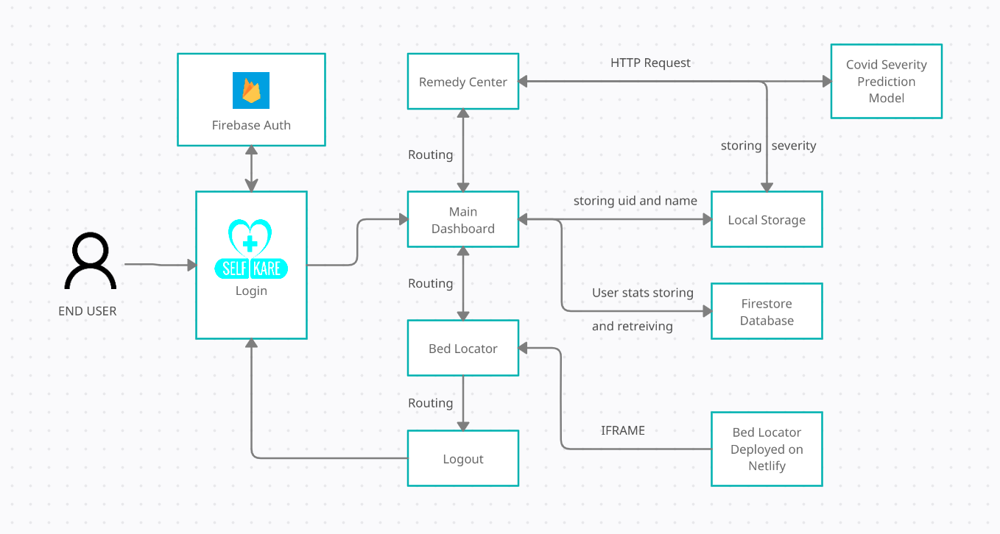

#### Title: Self Kare: An webapp for self care using home remedies during home isolation

DEMO LINK: [Youtube Video Link]()

WEBAPP LINK: [Click Here]()

> Description: An app designed to help you monitor your stats and get remedies during your home isolation. You can monitor your temperature, pulse rate and SpO2 levels using your interactive graphs and also download this data to show it during your next consultation with the doctor. We have also designed an ML model to predict your severity of COVID19 and then you can look up remedies accordingly. If your condition is worsening then you can check out the bed locator feature which will allow you to locate hospitals with different bed available all over Delhi.

#### The app contains the following features:

`Dashboard`: This section focuses on recording your stats like temperature, pulse rate and SpO2 levels and helps us to visualize it in the form od graphs. The user can also download this data to share it with his doctor show them the progression/regression of the stats over time.

`Remedy Center`: This section contains our ML model. The symptoms' data is collected using a form and sent to analyse. The analyzed severity of covid19 is then returned and used to display the home remedies accordingly.

`Bed Locator`: This section helps to locate different hospitals all over Delhi using a map. All the hospitals are marked according to the bed vacancy and their full details like address, contact numbers, oxygen left etc.

#### Hardware and Software Requirements:

A device with modern browser.

#### Tech Stack:

- Angular12
- Angular Modules
  1. Bootstrap4 & ng-Bootstrap (for styling)
  2. ApexChart (for plotting graphs)
  3. Firebase 2 (for backend and deployment of frontend)
- HTML5
- CDNs
  1. Font Awesome 5 (for icons)
- SCSS
- Typescript
- Javascript
- Javascript Modules
  1. Leaflet (for Maps)
- Python3
- Python3 Libraries
  1. Pandas
  2. flask
  3. Sklearn
  4. gunicorn
  5. flask_cors
  6. joblib
- Heroku (for deployment of ML model)

#### Data and Process Flow

